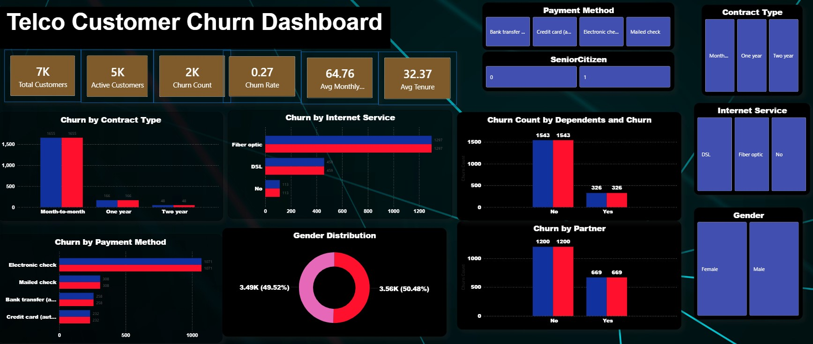

# 📊 Telco Customer Churn Analysis — SQL + Power BI Project

This project presents an end-to-end churn analysis using **SQL**, **Power BI**, and **DAX**.  
The goal is to understand why customers leave, which segments have the highest churn, and what actions can reduce customer loss.

---

## 📸 Dashboard Preview

Below is the main Power BI dashboard visual:




---

## 📌 Project Overview

- **Total Customers:** 7,032  
- **Churned Customers:** 1,869  
- **Churn Rate:** **26.58%**  
- **Average Tenure:**  
  - Churned → **37 months**  
  - Non-churned → **17 months**  
- **Average Monthly Charge (Fiber Optic users):** $91  

These metrics highlight that customer churn is a significant business problem requiring focused analysis.

---

## 🔍 Key Findings

### **1. Contract Type Strongly Influences Churn**
Month-to-month customers have the highest churn rate, showing they are less committed and more sensitive to price or service issues.

### **2. Fiber Optic Customers Churn the Most**
Fiber users show a **41.89%** churn rate — indicating service dissatisfaction or cost concerns.

### **3. High Monthly Charges + Low Tenure → High Churn**
Customers paying above \$100/month but having tenure under 6 months leave quickly.

### **4. Paperless Billing Shows Higher Churn**
Paperless billing customers churn at double the rate — billing confusion or failed payments may be a factor.

### **5. Senior Citizens Churn Significantly**
476 senior citizens churned — suggesting the need for simplified plans or better support.

### **6. Electronic Check Users Generate Highest Revenue but Churn Fastest**

---

## 🧮 DAX Measures

```DAX
Total Customers = COUNTROWS('WA_Fn-UseC_-Telco-Customer-Churn')

Churn Count =
CALCULATE(
    COUNTROWS('WA_Fn-UseC_-Telco-Customer-Churn'),
    'WA_Fn-UseC_-Telco-Customer-Churn'[Churn] = "Yes"
)

Active Customers =
CALCULATE(
    COUNTROWS('WA_Fn-UseC_-Telco-Customer-Churn'),
    'WA_Fn-UseC_-Telco-Customer-Churn'[Churn] = "No"
)

Churn Rate = DIVIDE([Churn Count], [Total Customers])

Avg Monthly Charges =
AVERAGE('WA_Fn-UseC_-Telco-Customer-Churn'[MonthlyCharges])

Avg Tenure =
AVERAGE('WA_Fn-UseC_-Telco-Customer-Churn'[tenure])

